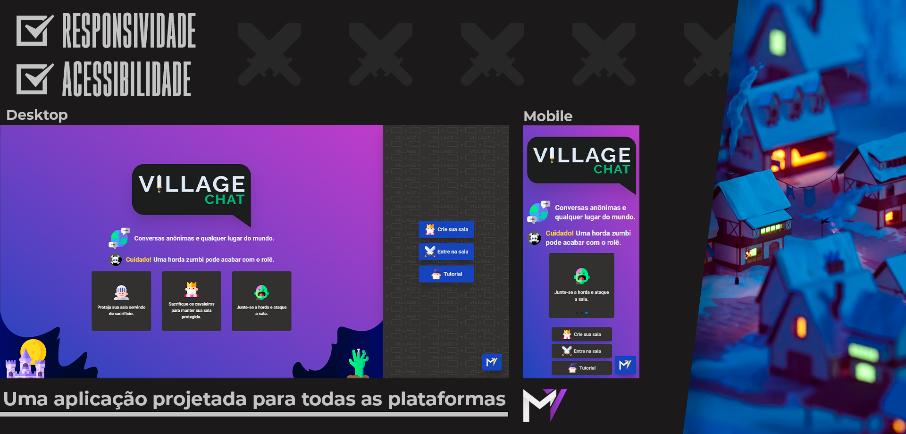
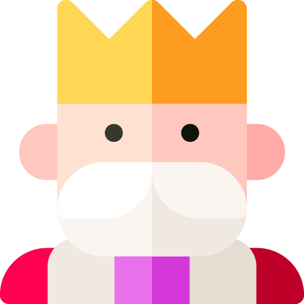
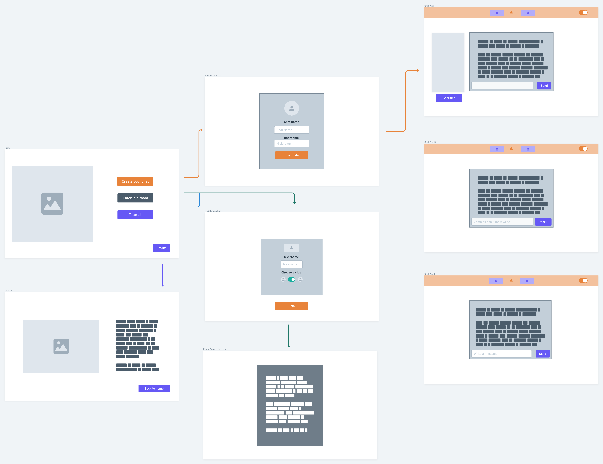
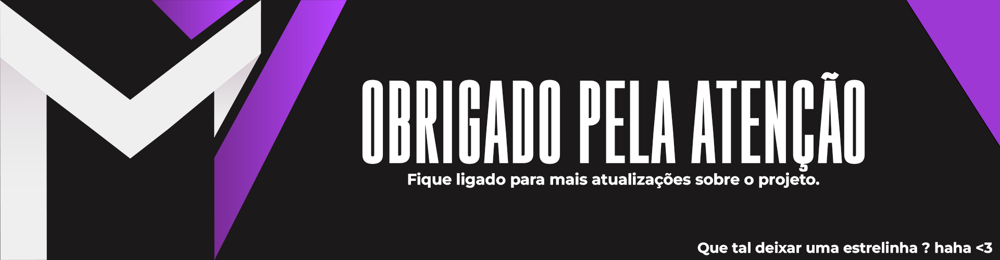

<h3 style="font-weight:bold">⚠️ PROJETO AINDA EN DANDAMENTO ⚠️<h3>

 

---

  <a style="color:#F806CC;font-weight:bold" href="#Projeto">Projeto</a>&nbsp;&nbsp;&nbsp;|&nbsp;&nbsp;&nbsp;
  <a style="color:#F806CC;font-weight:bold" href="#Desenvolvimento">Desenvolvimento</a>&nbsp;&nbsp;&nbsp;|&nbsp;&nbsp;&nbsp;
  <a style="color:#F806CC;font-weight:bold" href="#Features">Features</a>&nbsp;&nbsp;&nbsp;|&nbsp;&nbsp;&nbsp;
  <a style="color:#F806CC;font-weight:bold"
  href="#Extras">Extras</a>&nbsp;&nbsp;&nbsp;

### 💬 **Uma aplicação react de chat em tempo real com uma experiencia gamificada onde os usuários são totalmente anônimos.**

</img>

  

#  **Projeto**

### **No Village Chat temos 3 tipos de usuários:**

</img>
<section>
<h2 style="font-weight:bold">👑| Os Reis </h2>

Os Reis, Eles são os criadores da sala, mais conhecidos como <b>Admins</b>, além de interagirem normalmente com os demais usuários, eles chat geralmente controlam os assuntos abordados na sua sala, mas nem sempre conseguem manter o controle, principalmente durante um ataque zumbi, onde infelizmente o rei deverá escolher um de seus cavaleiros para servir de sacrifício e assim manter a sala segura, caso o contrário sua sala será totalmente excluída.

</section>

</img>
<section>
<h2 style="font-weight:bold">⚔️| Os Cavaleiros </h2>

Os cavaleiros, Estes são os verdadeiros nobres, apesar de não possuírem poderes além da interação comum na sala com o rei e os demais usuários, ao servirem de sacrifício eles salvam a sala e seus demais companheiros da ruina. ( Importante para o rei manter uma boa relação de amizade e saber administrar sua relação com os demais cavaleiros, uma vez que a quantidade de usúarios na sala e determinante para que ela sobreviva as hordas zumbís) .

</section>

</img>
<section>
<h2 style="font-weight:bold">🧟| Os Zumbis </h2>

Os Zumbís, pouco se sabe sobre eles, oque sabemos até agora é que não conseguem se comunicar com humanos, estes temidos usuários além de ficarem de olho em nossas conversas, ficam a espreita esperando uma perfeita oportunidade para atacar a sala assim excluindo-a junto ao rei e  todos seus cavaleiros cavaleiros, portanto tente não irritá-los. como fazer isso ?, infelizmente é uma pergunta que ainda não temos resposta. mas nossa equipe está empenhada em resolver esse problema o quanto antes.

</section>

#### **⚜️ | Para Saber mais acesse a o tutorial da aplicação no Link ➡️ [EM BREVE]**

  

#  **Desenvolvimento**

### **Sobre**:

Esta é uma aplicaçao react de chat em tempo real com uma experiencia gamificada onde os usuários sao totalmente anônimos. Inicialmente para Backend será utilizado a plataforma Firebase apenas para validação, futuramente será construido um backend próprio desenvolvido do 0 em NodeJS.

### **Linguagens**:

Typescript | Html | Css

### **Tecnologias**:

React | Tailwind CSS | Firebase (Será substituido por Node futuramente.)

### **Principais bibliotecas**:

Rxjs | Atropos | HeadlessUI | Phosphor-react

 
 

# **Features**:

#### **📢 | As features listadas a baixo podem sofrer alteraçoes diversas, como a aplicaçao ainda está em fase de desenvolvimento nenhuma delas é definitiva ou possui previsão e nem ordem de chegada.**

---

#### **✅Sistema de login**

#### **✅Chat em tempo real**

#### **⬜Acessibilidade**

#### **⬜Atualizações de segurança**

#### **⬜Sistema de gamificação completo**

 
 

# **Extras**

### **WireFrames**

</img>

---

 
 

</img>
Feito com ♥ by marciovinicius1 🍂 [Vamos nos conectar no Linkedin?](https://www.linkedin.com/in/marciovinicius1/)
